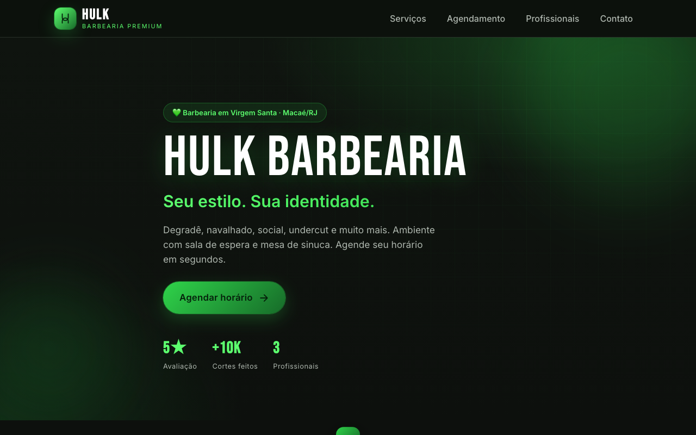
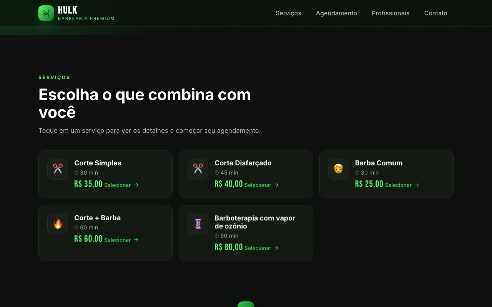
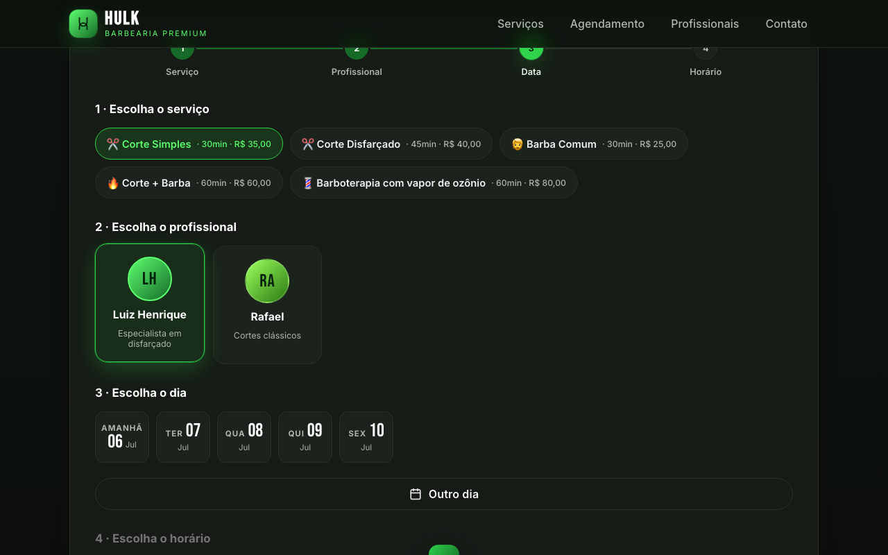
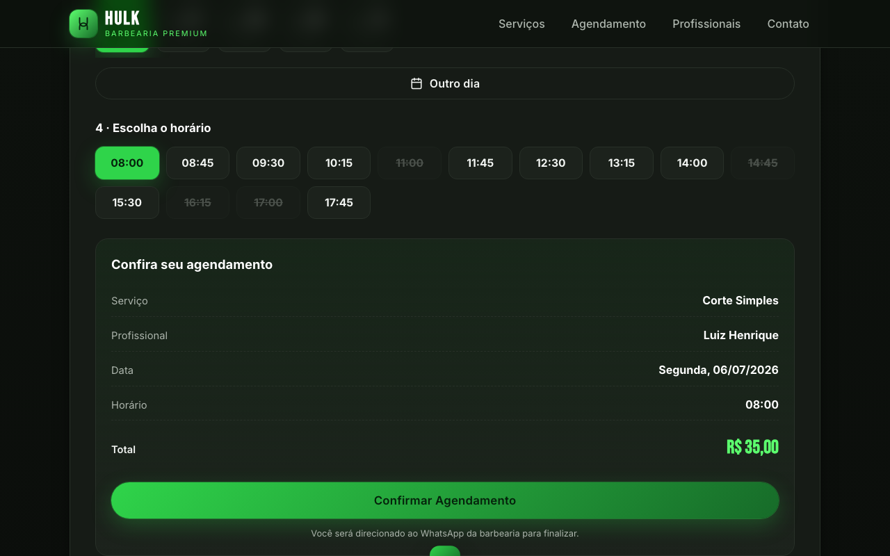
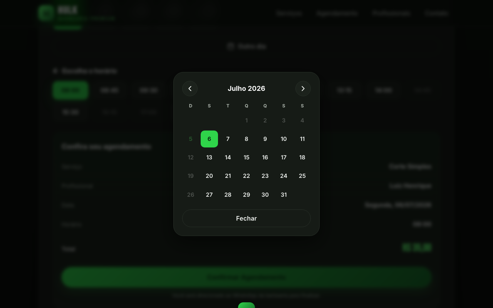
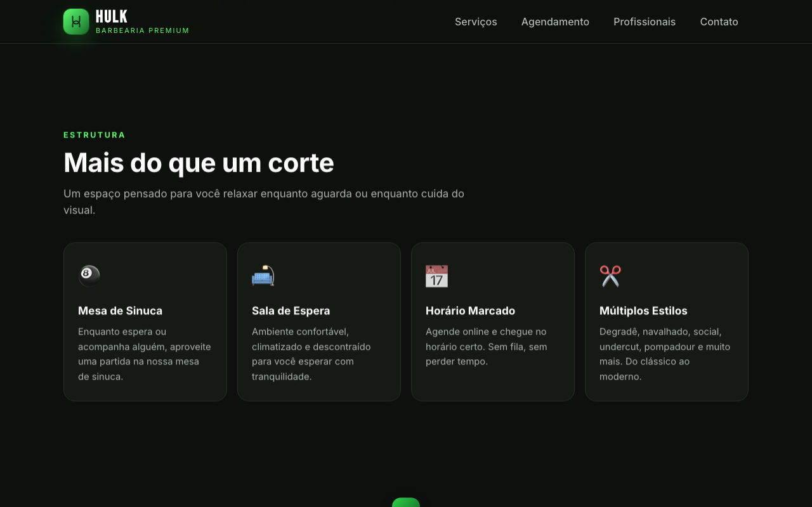
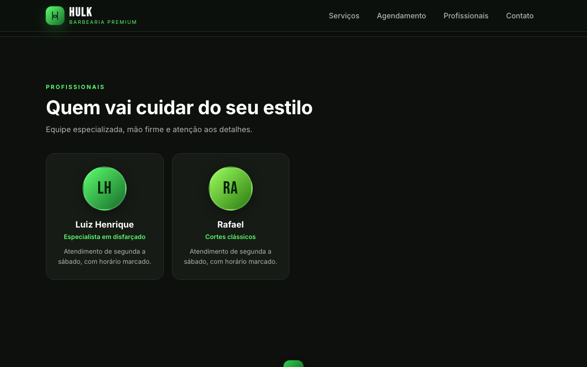
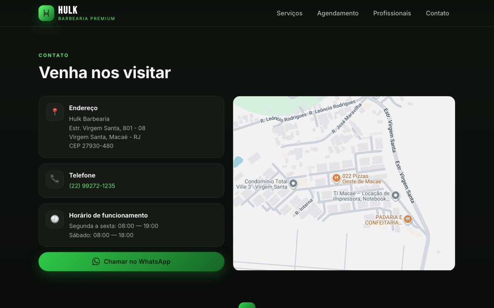
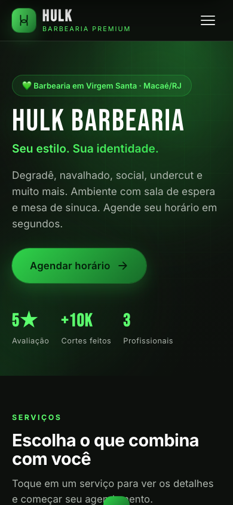
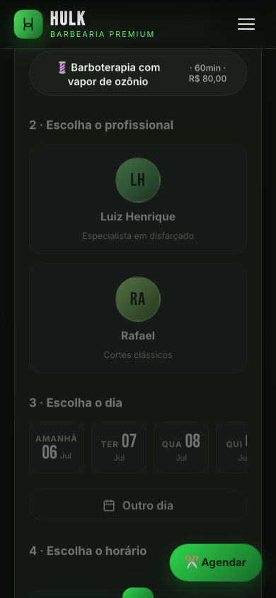

# Hulk Barbearia

> **Rodar localmente:** `.env.local` com as variáveis do Turso/admin → `node --env-file=.env.local scripts/migrate.mjs` → `npx vercel dev`. Detalhes em [Como iniciar o site](#como-iniciar-o-site-desenvolvimento-local).

cd /Users/robertorezendejr/Documents/www/Hulk-Barbearia
npx vercel dev

**Barbearia Premium em Virgem Santa, Macaé/RJ**  
Site de agendamento online — degradê, navalhado, social, undercut e muito mais.  
Sala de espera com mesa de sinuca. Horário marcado.

---

## Infraestrutura

**Domínio**: `hulkbarbearia.com.br`, gerenciado via Cloudflare DNS (nameservers trocados no Registro.br). Aponta pro Vercel com:

- `A hulkbarbearia.com.br → 76.76.21.21`
- `CNAME www → cname.vercel-dns.com`

Ambos configurados como **"Somente DNS"** (sem proxy) na Cloudflare.

**E-mail (Resend)**: integração instalada via Vercel Marketplace, plano Free, região São Paulo (`sa-east-1`). Domínio **verificado**, com os registros DNS na Cloudflare:

- `TXT resend._domainkey` (chave DKIM)
- `MX send → feedback-smtp.sa-east-1.amazonses.com` (prioridade 10)
- `TXT send → v=spf1 include:amazonses.com ~all`

**Google Calendar**: integrado via service account do Google Cloud — as env vars `GOOGLE_SERVICE_ACCOUNT_KEY` e `GOOGLE_CALENDAR_ID` já estão configuradas no Vercel.

**Variáveis de ambiente no Vercel** (production/preview/development): `RESEND_API_KEY`, `RESEND_EMAIL_DOMAIN`, `GOOGLE_SERVICE_ACCOUNT_KEY`, `GOOGLE_CALENDAR_ID`.

---

## Como iniciar o site (desenvolvimento local)

1. Crie um arquivo `.env.local` na raiz com:
   ```
   TURSO_DATABASE_URL=...
   TURSO_AUTH_TOKEN=...
   ADMIN_EMAIL=...
   ADMIN_PASSWORD=...
   ```
2. Rode a migração do banco (cria as tabelas, só precisa uma vez):
   ```bash
   node --env-file=.env.local scripts/migrate.mjs
   ```
3. Suba o servidor local:
   ```bash
   npx vercel dev
   ```
4. Acesse o endereço mostrado no terminal (ex: `http://localhost:3000`). O painel admin fica em `/admin`.

---



---

## Como o site funciona

O cliente agenda em menos de 60 segundos, direto pelo celular ou computador, sem precisar ligar.

### 1 · Escolha o serviço



Cards com todos os serviços, duração e valor. Clicar em qualquer card seleciona o serviço e rola automaticamente para o agendamento.

| Serviço                            | Duração | Valor    |
| ---------------------------------- | ------- | -------- |
| ✂️ Corte Simples                   | 30 min  | R$ 35,00 |
| ✂️ Corte Disfarçado                | 45 min  | R$ 40,00 |
| 🧔 Barba Comum                     | 30 min  | R$ 25,00 |
| 🔥 Corte + Barba                   | 60 min  | R$ 60,00 |
| 💈 Barboterapia c/ vapor de ozônio | 60 min  | R$ 80,00 |

---

### 2 · Escolha o profissional



Selecione o barbeiro de preferência. Cada profissional tem sua própria grade de horários disponíveis.

---

### 3 · Escolha o dia e o horário



Os próximos dias úteis aparecem em cards. Horários já ocupados ficam bloqueados automaticamente.  
O botão **"Outro dia"** abre um calendário completo para escolher qualquer data futura.

---

### 4 · Modal de calendário



Navegue entre meses com as setas. Domingos e datas passadas ficam desativados. Feche com **Esc** ou clicando fora.

---

### 5 · Confirmação via WhatsApp

Após escolher serviço, profissional, data e horário, o resumo aparece com o total. Ao confirmar, o WhatsApp abre com a mensagem já preenchida:

```
*Novo agendamento — Hulk Barbearia* 💚

✂️ Serviço: Corte Simples
💈 Profissional: Luiz Henrique
📅 Data: Segunda, 06/07/2026
🕐 Horário: 08:00
💰 Valor: R$ 35,00 (30 min)

Confirma pra mim, por favor?
```

---

## Estrutura — Diferenciais



| 🎱 Sinuca                                  | 🛋️ Sala de espera                  | 📅 Horário marcado                | ✂️ Múltiplos estilos                        |
| ------------------------------------------ | ---------------------------------- | --------------------------------- | ------------------------------------------- |
| Mesa de sinuca disponível enquanto aguarda | Ambiente climatizado e confortável | Sem fila, chegue no horário certo | Degradê, navalhado, social, undercut e mais |

---

## Equipe



---

## Contato & Localização



|             |                                                                       |
| ----------- | --------------------------------------------------------------------- |
| 📍 Endereço | Estr. Virgem Santa, 801 - 08, Virgem Santa — Macaé/RJ — CEP 27930-480 |
| 📞 Telefone | (22) 99272-1235                                                       |
| 💬 WhatsApp | (22) 99622-8571                                                       |
| 🕗 Seg–Sex  | 08:00 às 19:00                                                        |
| 🕗 Sábado   | 08:00 às 18:00                                                        |

---

## Versão Mobile

| Hero                                                | Agendamento                                                       |
| --------------------------------------------------- | ----------------------------------------------------------------- |
|  |  |

Site **mobile-first**: botão flutuante "✂️ Agendar" aparece ao rolar, menu hambúrguer, toque sem delay.

---

## Tecnologias

Site estático puro — sem backend, sem banco de dados, sem build.

| Arquivo       | Função                                           |
| ------------- | ------------------------------------------------ |
| `index.html`  | Estrutura da página                              |
| `styles.css`  | Visual dark premium + animações + responsividade |
| `app.js`      | Agendamento, calendário e integração WhatsApp    |
| `vercel.json` | Configuração de deploy                           |
| `sitemap.xml` | Indexação no Google                              |
| `robots.txt`  | Rastreamento de buscadores                       |

---

_Hulk Barbearia · Virgem Santa, Macaé/RJ_
