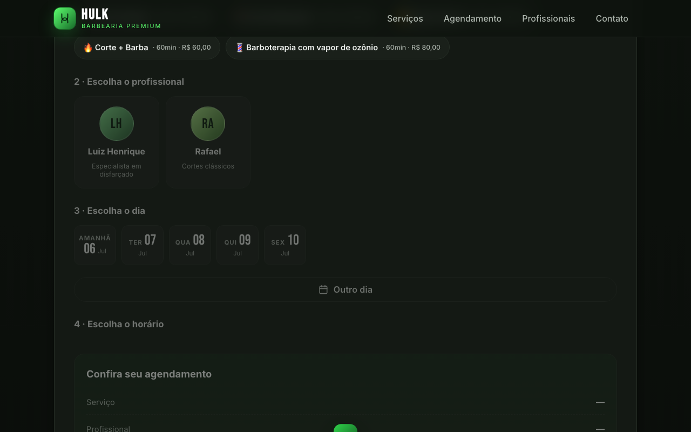

# Hulk Barbearia — Guia do Site

> Documentação visual e passo a passo de como o site funciona.  
> Barbearia Premium · Virgem Santa, Macaé/RJ

---

## Visão Geral

O site é uma **página única** (single-page) com agendamento online completo. O cliente sai com o horário marcado em menos de 60 segundos, sem precisar ligar ou mandar mensagem.

```
┌─────────────────────────────────────────────────────┐
│  HEADER fixo — Logo + Menu de navegação             │
├─────────────────────────────────────────────────────┤
│  HERO — Apresentação + botão "Agendar horário"      │
├─────────────────────────────────────────────────────┤
│  SERVIÇOS — Cards com preço e duração               │
├─────────────────────────────────────────────────────┤
│  AGENDAMENTO — Fluxo de 4 etapas                    │
├─────────────────────────────────────────────────────┤
│  PROFISSIONAIS — Equipe da barbearia                │
├─────────────────────────────────────────────────────┤
│  ESTRUTURA — Sala de espera, sinuca, diferenciais   │
├─────────────────────────────────────────────────────┤
│  CONTATO — Endereço, telefone, mapa e WhatsApp      │
└─────────────────────────────────────────────────────┘
```

---

## 1. Header & Navegação


O topo fica **fixo na tela** enquanto o usuário rola a página.

| Elemento | Função |
|---|---|
| Logo **HULK** | Clica e volta ao topo |
| Menu **Serviços** | Rola até os cards de serviço |
| Menu **Agendamento** | Rola direto para o fluxo de agendamento |
| Menu **Profissionais** | Rola até a equipe |
| Menu **Contato** | Rola até endereço + mapa |

> 📱 **No celular:** o menu vira um ícone hambúrguer (☰). Toque para abrir/fechar.

---

## 2. Hero — Chamada Principal

A primeira tela apresenta a barbearia e conduz o cliente para o agendamento.

- Badge: localização em Virgem Santa, Macaé/RJ
- Título principal + subtítulo com identidade da marca
- Descrição dos serviços e diferenciais (sinuca, sala de espera)
- Botão **"Agendar horário"** — leva direto ao fluxo
- Números de credibilidade: **5★ · +10K cortes · 3 profissionais**

> 📱 **No celular:** após rolar para baixo, aparece um botão verde flutuante **"✂️ Agendar"** fixo no canto inferior direito.

---

## 3. Serviços


Cards com todos os serviços disponíveis. Clicar em qualquer card **seleciona o serviço e rola automaticamente** para o agendamento.

| Serviço | Duração | Valor |
|---|---|---|
| ✂️ Corte Simples | 30 min | R$ 35,00 |
| ✂️ Corte Disfarçado | 45 min | R$ 40,00 |
| 🧔 Barba Comum | 30 min | R$ 25,00 |
| 🔥 Corte + Barba | 60 min | R$ 60,00 |
| 💈 Barboterapia c/ vapor de ozônio | 60 min | R$ 80,00 |

---

## 4. Agendamento — Fluxo de 4 Etapas



O sistema guia o cliente etapa por etapa. Cada etapa só libera após a anterior ser concluída.

---

### Etapa 1 · Escolha o serviço

Chips (botões compactos) com todos os serviços. Toque em um para selecionar.

```
[ ✂️ Corte Simples · 30min · R$ 35,00 ]
[ ✂️ Corte Disfarçado · 45min · R$ 40,00 ]
[ 🧔 Barba Comum · 30min · R$ 25,00 ]  ← selecionado fica verde
[ 🔥 Corte + Barba · 60min · R$ 60,00 ]
[ 💈 Barboterapia · 60min · R$ 80,00 ]
```

---

### Etapa 2 · Escolha o profissional


Cards com avatar, nome e especialidade de cada barbeiro. Toque para selecionar.

```
┌──────────────┐
│     [LH]     │
│ Luiz Henrique│
│ Especialista │
│  degradê     │
└──────────────┘
```

---

### Etapa 3 · Escolha o dia

Cards com os próximos dias úteis (sem domingo — barbearia fechada).

```
[ Hoje  ] [ Amanhã ] [ Ter ] [ Qua ] [ Qui ]
[ 05/07 ] [ 06/07  ] [07/07] [08/07] [10/07]
```

> **"Outro dia"** → abre o **modal de calendário** para escolher qualquer data futura.

---

### Modal de Calendário


Calendário completo com navegação por mês.

- Setas **‹ ›** para avançar/voltar meses
- Datas passadas ficam **desativadas** (cinza)
- Domingos ficam **desativados** (barbearia fechada)
- Data de hoje fica em **verde brilhante**
- Data selecionada fica com **fundo verde**
- Fechar: botão "Fechar", clique no fundo escuro ou tecla **Esc**

---

### Etapa 4 · Escolha o horário


Grade com todos os horários do dia (08:00 às 18:00, intervalos de 45 min).

```
[ 08:00 ] [ 08:45 ] [ 09:30 ] [ 10:15 ] [ 11:00* ]
[ 11:45 ] [ 12:30 ] [ 13:15 ] [ 14:00 ] [ 14:45* ]
[ 15:30 ] [ 16:15*] [ 17:00*] [ 17:45 ]
```

`*` = horário **ocupado** (aparece riscado e inativo)

---

### Resumo e Confirmação

Após escolher o horário, o resumo final aparece:

| Campo | Exemplo |
|---|---|
| Serviço | Corte Simples |
| Profissional | Luiz Henrique |
| Data | Segunda, 06/07/2026 |
| Horário | 08:00 |
| **Total** | **R$ 35,00** |

Botão **"Confirmar Agendamento"** → abre o **WhatsApp da barbearia** com a mensagem já preenchida:

```
*Novo agendamento — Hulk Barbearia* 💚

✂️ Serviço: Corte Simples
💈 Profissional: Luiz Henrique
📅 Data: Segunda, 06/07/2026
🕐 Horário: 08:00
💰 Valor: R$ 35,00 (30 min)

Confirma pra mim, por favor?
```

---

## 5. Equipe


Seção institucional apresentando os barbeiros com avatar, nome, especialidade e disponibilidade.

---

## 6. Estrutura — Diferenciais


Cards destacando os diferenciais do espaço:

| 🎱 Mesa de Sinuca | 🛋️ Sala de Espera | 📅 Horário Marcado | ✂️ Múltiplos Estilos |
|---|---|---|---|
| Jogue uma partida enquanto espera | Ambiente climatizado e confortável | Sem fila, chegue no horário certo | Degradê, navalhado, social, undercut e mais |

---

## 7. Contato & Localização


| Info | Dados |
|---|---|
| 📍 Endereço | Estr. Virgem Santa, 801 - 08, Macaé/RJ — CEP 27930-480 |
| 📞 Telefone | [(22) 99272-1235](tel:+5522992721235) |
| 🕗 Seg–Sex | 08:00 às 19:00 |
| 🕗 Sábado | 08:00 às 18:00 |
| 💬 WhatsApp | Botão direto para conversa |

Mapa do Google integrado com pin na localização exata.

---

## 8. Versão Mobile

| Hero | Agendamento |
|---|---|
|  |  |

O site é **mobile-first** — projetado primeiro para celular:

- Menu hambúrguer no topo
- Cards empilhados em coluna única
- Horários em grid adaptável
- Botão FAB flutuante "✂️ Agendar" aparece ao rolar
- Toque otimizado (sem delay de 300ms)
- Calendário modal centralizado e responsivo

---

## Tecnologias

| Arquivo | Função |
|---|---|
| `index.html` | Estrutura completa da página |
| `styles.css` | Visual premium dark, animações, responsividade |
| `app.js` | Lógica do agendamento, calendário e integração WhatsApp |
| `vercel.json` | Configuração de deploy |
| `sitemap.xml` | Indexação no Google |
| `robots.txt` | Permissão de rastreamento |

> Site estático puro — sem backend, sem banco de dados, sem dependências.  
> Funciona em qualquer hospedagem estática (Vercel, Netlify, GitHub Pages).

---

*Hulk Barbearia · Virgem Santa, Macaé/RJ*
